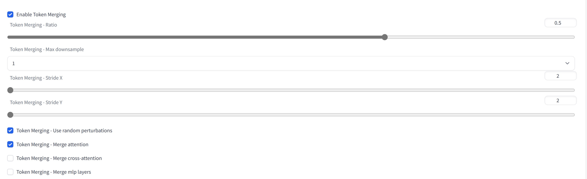

# ToMeSD-webui
https://github.com/dbolya/tomesd

Extension for [AUTOMATIC1111/stable-diffusion-webui](https://github.com/AUTOMATIC1111/stable-diffusion-webui).

Needs to be enabled in settings *before* loading the model. Furthermore, all settings are only applied at model load time.

